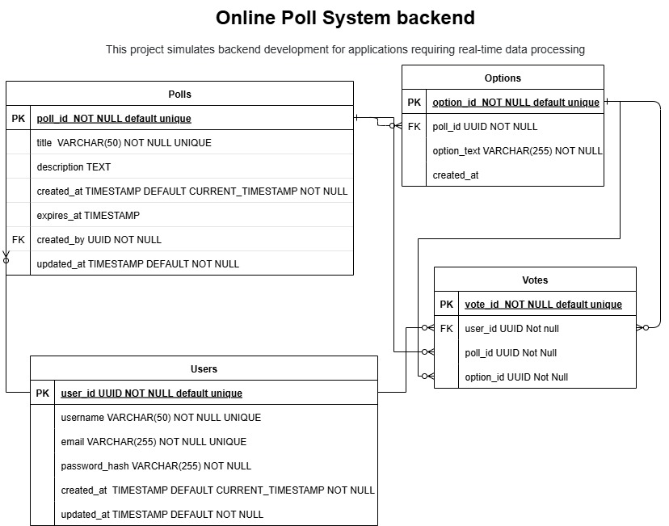

# Online Poll System Backend

A Django-based backend application for managing online polls with real-time data processing capabilities. This system allows users to create polls, vote on options, and view results in a structured and secure environment.

## 🎯 Project Overview

This project simulates backend development for applications requiring real-time data processing. The system provides a robust foundation for creating and managing online polls with user authentication, poll creation, option management, and vote tracking.

### Key Features

- **User Management**: User registration and authentication system
- **Poll Creation**: Create polls with custom titles and descriptions
- **Option Management**: Add multiple options to polls
- **Voting System**: Secure voting mechanism with user tracking
- **Real-time Data**: Live poll results and vote counting
- **Expiration Handling**: Set expiration dates for polls
- **Data Integrity**: Foreign key relationships ensure data consistency

## 🛠 Technology Stack

- **Framework**: Django 5.2.5
- **Database**: PostgresDB
- **Language**: Python 3.10+
- **ORM**: Django ORM

## 📊 Database Schema

The application follows a relational database design with four main entities:



### Users Table
| Field | Type | Constraints |
|-------|------|-------------|
| user_id | UUID | PRIMARY KEY, NOT NULL, DEFAULT unique |
| username | VARCHAR(50) | NOT NULL, UNIQUE |
| email | VARCHAR(255) | NOT NULL, UNIQUE |
| password_hash | VARCHAR(255) | NOT NULL |
| created_at | TIMESTAMP | DEFAULT CURRENT_TIMESTAMP, NOT NULL |
| updated_at | TIMESTAMP | DEFAULT NOT NULL |

### Polls Table
| Field | Type | Constraints |
|-------|------|-------------|
| poll_id | NOT NULL | PRIMARY KEY, DEFAULT unique |
| title | VARCHAR(50) | NOT NULL, UNIQUE |
| description | TEXT | |
| created_at | TIMESTAMP | DEFAULT CURRENT_TIMESTAMP, NOT NULL |
| expires_at | TIMESTAMP | |
| created_by | UUID | FOREIGN KEY → Users(user_id), NOT NULL |
| updated_at | TIMESTAMP | DEFAULT NOT NULL |

### Options Table
| Field | Type | Constraints |
|-------|------|-------------|
| option_id | NOT NULL | PRIMARY KEY, DEFAULT unique |
| poll_id | UUID | FOREIGN KEY → Polls(poll_id), NOT NULL |
| option_text | VARCHAR(255) | NOT NULL |
| created_at | TIMESTAMP | |

### Votes Table
| Field | Type | Constraints |
|-------|------|-------------|
| vote_id | NOT NULL | PRIMARY KEY, DEFAULT unique |
| user_id | UUID | FOREIGN KEY → Users(user_id), NOT NULL |
| poll_id | UUID | FOREIGN KEY → Polls(poll_id), NOT NULL |
| option_id | UUID | FOREIGN KEY → Options(option_id), NOT NULL |

## 🔗 Entity Relationships

1. **Users → Polls**: One-to-Many (One user can create multiple polls)
2. **Polls → Options**: One-to-Many (One poll can have multiple options)
3. **Users → Votes**: One-to-Many (One user can cast multiple votes)
4. **Polls → Votes**: One-to-Many (One poll can receive multiple votes)
5. **Options → Votes**: One-to-Many (One option can receive multiple votes)

## 🚀 Installation & Setup

### Prerequisites
- Python 3.10 or higher
- pip (Python package manager)
- Git

### Step-by-Step Installation

1. **Clone the repository**
   ```bash
   git clone <repository-url>
   cd alx-project-nexus/onlinepollsystem
   ```

2. **Create virtual environment**
   ```bash
   python -m venv venv
   source venv/bin/activate  # On Windows: venv\Scripts\activate
   ```

3. **Install dependencies**
   ```bash
   pip install -r requirements.txt
   ```

4. **Set up environment variables**
   ```bash
   cp .env.example .env
   # Edit .env file with your configuration
   ```

5. **Configure database**
   - For development (SQLite): No additional setup needed
   - For production (PostgreSQL): Update .env with database credentials

6. **Run database migrations**
   ```bash
   python manage.py makemigrations
   python manage.py migrate
   ```

7. **Create superuser (optional)**
   ```bash
   python manage.py createsuperuser
   ```

8. **Start development server**
   ```bash
   python manage.py runserver
   ```

The application will be available at `http://127.0.0.1:8000/`

## 📡 API Endpoints

### Base URL: `/api/v1/`

### Authentication
- `POST /api/v1/auth/register/` - User registration
- `POST /api/v1/auth/login/` - User login
- `POST /api/v1/auth/logout/` - User logout
- `POST /api/v1/token/` - Obtain JWT token pair
- `POST /api/v1/token/refresh/` - Refresh JWT token
- `POST /api/v1/token/verify/` - Verify JWT token

### User Management
- `GET /api/v1/users/` - List users (admin only)
- `GET /api/v1/users/{id}/` - Get user details
- `PUT /api/v1/users/{id}/` - Update user information
- `GET /api/v1/users/profile/` - Get current user profile
- `PUT /api/v1/users/update_profile/` - Update current user profile
- `POST /api/v1/users/change_password/` - Change password
- `GET /api/v1/users/voting_history/` - Get user's voting history

### Poll Management
- `GET /api/v1/polls/` - List all polls
- `POST /api/v1/polls/` - Create new poll
- `GET /api/v1/polls/{id}/` - Get poll details
- `PUT /api/v1/polls/{id}/` - Update poll (owner only)
- `DELETE /api/v1/polls/{id}/` - Delete poll (owner only)
- `GET /api/v1/polls/{id}/results/` - Get poll results
- `POST /api/v1/polls/{id}/vote/` - Cast vote on poll
- `GET /api/v1/polls/{id}/options/` - Get poll options
- `POST /api/v1/polls/{id}/add_option/` - Add option to poll (owner only)
- `GET /api/v1/polls/my_polls/` - Get current user's polls
- `GET /api/v1/polls/active_polls/` - Get all active polls

### Options Management
- `GET /api/v1/options/` - List options (filterable by poll)
- `POST /api/v1/options/` - Create option
- `GET /api/v1/options/{id}/` - Get option details
- `PUT /api/v1/options/{id}/` - Update option
- `DELETE /api/v1/options/{id}/` - Delete option

### Voting
- `GET /api/v1/votes/` - List user's votes
- `GET /api/v1/votes/{id}/` - Get vote details

### API Documentation
- `GET /api/docs/` - Swagger UI documentation
- `GET /api/redoc/` - ReDoc documentation
- `GET /api/schema/` - OpenAPI schema

## 💻 Usage Examples

### Creating a Poll
```python
# Example POST request to /api/polls/
{
    "title": "Favorite Programming Language",
    "description": "Vote for your favorite programming language",
    "expires_at": "2025-12-31T23:59:59Z",
    "options": [
        {"option_text": "Python"},
        {"option_text": "JavaScript"},
        {"option_text": "Java"},
        {"option_text": "C++"}
    ]
}
```

### Casting a Vote
```python
# Example POST request to /api/polls/{poll_id}/vote/
{
    "option_id": "uuid-of-selected-option"
}
```

### Getting Poll Results
```python
# Example GET response from /api/polls/{poll_id}/results/
{
    "poll_id": "poll-uuid",
    "title": "Favorite Programming Language",
    "total_votes": 150,
    "results": [
        {"option_text": "Python", "votes": 75, "percentage": 50.0},
        {"option_text": "JavaScript", "votes": 45, "percentage": 30.0},
        {"option_text": "Java", "votes": 20, "percentage": 13.33},
        {"option_text": "C++", "votes": 10, "percentage": 6.67}
    ]
}
```

## 🗂 Project Structure

```
onlinepollsystem/
├── manage.py                    # Django management script
├── requirements.txt             # Python dependencies
├── .env.example                # Environment variables template
├── .gitignore                  # Git ignore file
├── README.md                   # Project documentation
├── Online_system_backend.jpg   # ERD diagram
├── onlinepollsystem/           # Main project directory
│   ├── __init__.py
│   ├── settings/              # Settings module
│   │   ├── __init__.py
│   │   ├── base.py           # Base settings
│   │   ├── development.py    # Development settings
│   │   ├── production.py     # Production settings
│   │   └── testing.py        # Testing settings
│   ├── urls.py               # Main URL routing
│   ├── wsgi.py               # WSGI configuration
│   └── asgi.py               # ASGI configuration
├── apps/                      # Django applications
│   ├── __init__.py
│   ├── core/                 # Core utilities and base models
│   │   ├── __init__.py
│   │   ├── models.py         # Base models (BaseModel, TimestampedModel)
│   │   ├── permissions.py    # Custom permissions
│   │   ├── pagination.py     # Custom pagination classes
│   │   ├── exceptions.py     # Custom exceptions
│   │   └── utils.py          # Utility functions
│   ├── users/                # User management app
│   │   ├── __init__.py
│   │   ├── admin.py          # Admin configuration
│   │   ├── apps.py           # App configuration
│   │   ├── models.py         # User model
│   │   ├── managers.py       # Custom user manager
│   │   ├── serializers.py    # API serializers
│   │   ├── views.py          # API views and viewsets
│   │   ├── urls.py           # URL routing
│   │   └── migrations/       # Database migrations
│   └── polls/                # Poll management app
│       ├── __init__.py
│       ├── admin.py          # Admin configuration
│       ├── apps.py           # App configuration
│       ├── models.py         # Poll, Option, Vote models
│       ├── serializers.py    # API serializers
│       ├── views.py          # API views and viewsets
│       ├── urls.py           # URL routing
│       ├── signals.py        # Django signals
│       └── migrations/       # Database migrations
├── tests/                    # Test files
│   ├── __init__.py
│   ├── test_users/          # User app tests
│   ├── test_polls/          # Poll app tests
│   └── test_integration/    # Integration tests
├── static/                  # Static files
└── media/                   # User uploaded files
```

### 📁 App Structure Explanation

#### **Core App** (`apps/core/`)
- **Base Models**: Abstract models with common fields (UUID, timestamps)
- **Permissions**: Custom permission classes for API security
- **Pagination**: Standardized pagination for API responses
- **Utils**: Helper functions for poll calculations and validations
- **Exceptions**: Custom exception handling

#### **Users App** (`apps/users/`)
- **Custom User Model**: Extended user model with UUID primary key
- **Authentication**: JWT-based authentication system
- **User Management**: Registration, login, profile management
- **API Endpoints**: RESTful API for user operations

#### **Polls App** (`apps/polls/`)
- **Poll Management**: Create, update, delete polls
- **Options**: Manage poll options and choices
- **Voting System**: Secure voting with validation
- **Results**: Real-time poll results and analytics
- **API Endpoints**: RESTful API for all poll operations

## 🔒 Security Features

- **Password Hashing**: User passwords are securely hashed
- **UUID Primary Keys**: Prevents enumeration attacks
- **CSRF Protection**: Built-in Django CSRF middleware
- **Input Validation**: Django form validation for all inputs
- **Authentication Required**: Protected endpoints require authentication

## 🎯 Future Enhancements

- [ ] Real-time vote updates using WebSockets
- [ ] Poll analytics and reporting
- [ ] Email notifications for poll creation/expiration
- [ ] File upload support for poll images
- [ ] Advanced poll types (multiple choice, ranking)
- [ ] Social media integration
- [ ] API rate limiting
- [ ] Comprehensive test suite

## 🤝 Contributing

1. Fork the repository
2. Create a feature branch (`git checkout -b feature/new-feature`)
3. Commit your changes (`git commit -am 'Add new feature'`)
4. Push to the branch (`git push origin feature/new-feature`)
5. Create a Pull Request

## 📄 License

This project is licensed under the MIT License - see the LICENSE file for details.

## 👥 Authors

- **ALX Software Engineering Program** - *Initial work*

## 🙏 Acknowledgments

- Django Documentation
- ALX Software Engineering Program
- Contributors and reviewers

---

*This project is part of the ALX Software Engineering curriculum focusing on backend development and real-time data processing.*
